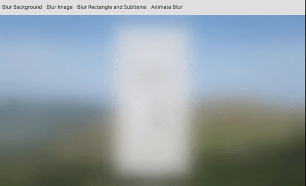
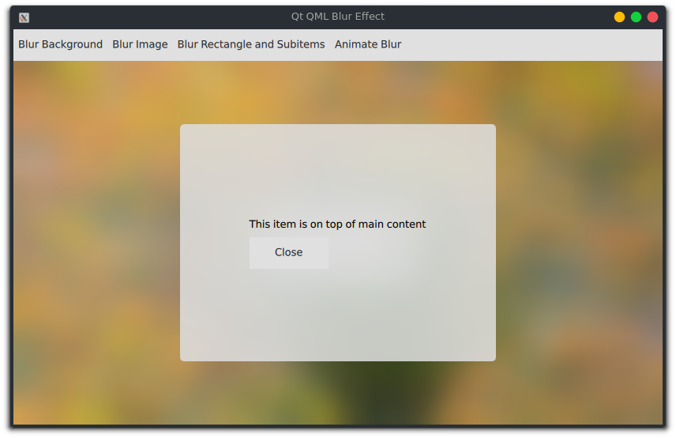
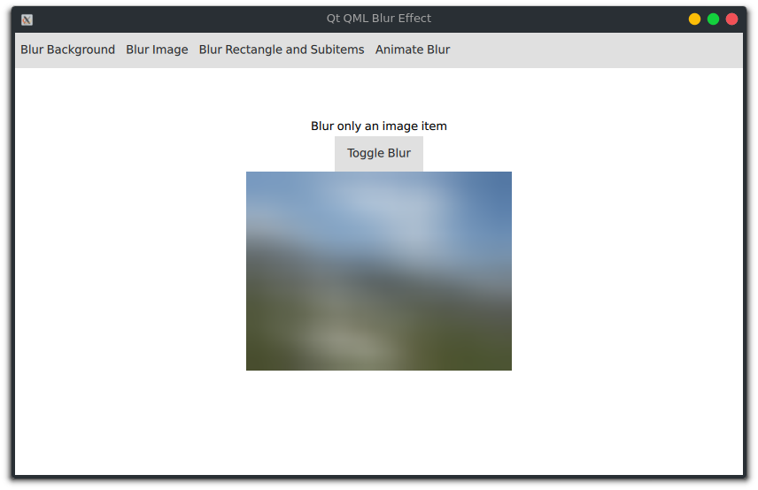
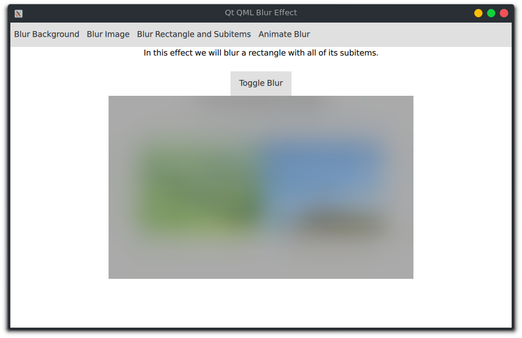

= Qt QML Blur Effect
Hesam Gholami <hesamgholami@yahoo.com>
v1.0, 2019-06-12

++++
<link rel="stylesheet"  href="http://cdnjs.cloudflare.com/ajax/libs/font-awesome/3.1.0/css/font-awesome.min.css">
++++
:icons: font
:experimental: true

== Quick Start

This project is created using Qt. So you need only to install Qt and then open up the project in _Qt Creator_ IDE.

https://qt.io/download

== Blur Effects

In this project we have some different types of blur effect whih will be useful in different situations.

=== Display Content on Top of Blurred Area

This type of blur effect will be used to blur current content and then show something new on top of it to gather user interaction.

This effect will provide a slick and smooth experience for users.

[source, qml]
----
    Item {
        id: blurBackgroundPage

        // Main content that will be blurred
        Item {
            id: blurPageMainContent
            anchors.fill: parent

            Image {
                id: imgBackground
                // ...
            }

            Rectangle {
                // ...

                Column {
                    // ...

                    Text {
                        text: qsTr("Hi")
                    }

                    Button {
                        text: qsTr("Blur")
                        onClicked: {
                            // Here we will show blur effect
                            blurBackgroundOverlay.visible = true
                            blurPageOverlayContent.visible = true
                        }
                    }
                }

            }

        }

        FastBlur
        {
            id: blurBackgroundOverlay
            visible: false
            anchors.fill: blurPageMainContent
            source: blurPageMainContent
            radius: 85
        }

        // Top content to show up on blurred area
        Item {
            id: blurPageOverlayContent
            anchors.fill: parent
            visible: false

            Rectangle {
                // ...

                Column {
                    spacing: 5
                    anchors.centerIn: parent

                    Text {
                        text: qsTr("This item is on top of main content")
                    }

                    Button {
                        text: qsTr("Close")
                        onClicked: {
                            // Here we will discard blur effect
                            blurBackgroundOverlay.visible = false
                            blurPageOverlayContent.visible = false
                        }
                    }
                }
            }

        }

    }
----

=== Blur a Single Item

In this mode we will blur only a single element.

[source, qml]
----
    // Blur single item
    Item {
        id: blurImagePage

        Button {
            id: buttonBlurToggleFilbandMountainsImage
            // ...
            text: qsTr("Toggle Blur")
            onClicked: blurImageFilbandMountains.visible = !blurImageFilbandMountains.visible
        }

        Image {
            id: imgFilbandMountainsWithSnow
            width: 300
            anchors.centerIn: parent
            fillMode: Image.PreserveAspectFit
            source: "qrc:/images/filband-mountains.jpg"
        }

        FastBlur
        {
            id: blurImageFilbandMountains
            visible: false
            anchors.fill: imgFilbandMountainsWithSnow
            source: imgFilbandMountainsWithSnow
            radius: 85
        }
    }
----

=== Blur an Item and Subitems

In this type of blur, we are going to blur a rectangle with all of its subitems.
In this mode, the blur effect will correctly merge all subitems without needing of creating multiple blur effects for different items.

[source, qml]
----
    Item {
        id: blurRectangleAndSubitemsPage

        // ...
        
        Button {
            // ...
            text: qsTr("Toggle Blur")
            onClicked: blurRectangleAndSubItems.visible = !blurRectangleAndSubItems.visible
        }

        // This rectangle has multiple items which all of them will be blurred
        Rectangle {
            id: rectMultpleSubitems
            // ...

            Row {
                anchors.centerIn: parent
                Image {
                    id: imgFilbandGuySmoking
                    // ...
                }

                Image {
                    id: imgFilbandMakingLove
                    // ...
                }
            }

            Text {
                // ...
                text: qsTr("I am a text inside this rectangle!")
            }
        }

        FastBlur
        {
            id: blurRectangleAndSubItems
            visible: false
            anchors.fill: rectMultpleSubitems
            source: rectMultpleSubitems
            radius: 85
        }
    }
----

=== Animating Blur Effect

It will be cool to animate blur instead of simple showing it instantly.
Fortunately this can be achieved simply using QML `Behavior`s.

[source, qml]
----
    Item {
        id: animateBlurPage

        // Toggle animation every 2 seconds, so we can see it multiple times
        Timer {
            id: timerBlurAnimation
            running: true
            interval: 2000
            repeat: true

            onTriggered: blurAnimationOverlay.opacity = blurAnimationOverlay.visible ? 0 : 1
        }

        Item {
            id: blurAnimationPageMainContent
            anchors.fill: parent

            Image {
                id: imgAnimatedBlurBackground
                // ...
            }

            Rectangle {
                // ...

                Column {
                    spacing: 5
                    anchors.centerIn: parent

                    Text {
                        text: qsTr("Wait to see blur")
                    }

                    Button {
                        text: qsTr("Dummy")
                    }

                    CheckBox {
                        text: qsTr("Dummy")
                    }

                    RadioButton {
                        text: qsTr("Dummy")
                    }
                }

            }

        }

        FastBlur
        {
            id: blurAnimationOverlay
            opacity: 0
            visible: opacity !== 0
            anchors.fill: blurAnimationPageMainContent
            source: blurAnimationPageMainContent
            radius: 85

            // This Behavior will let us to animate blur effect with its opacity
            Behavior on opacity
            {
                NumberAnimation
                {
                    duration: 500
                    easing.type: Easing.InOutQuad
                }
            }
        }
    }
----

== Contributing

So that was it!

If you enjoyed this project, please consider contributing to it and make it better.

And please don't forget to give a star to this project.

Thank you and happy coding!
